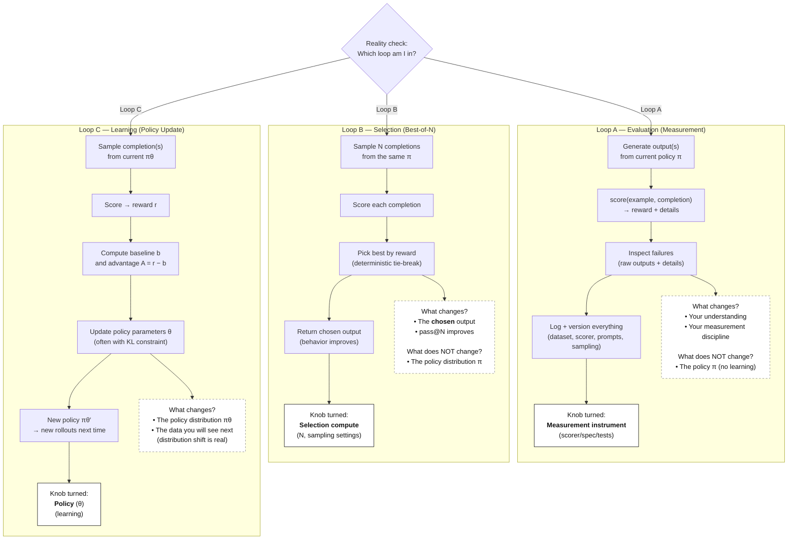
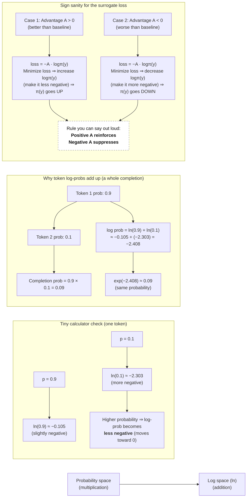
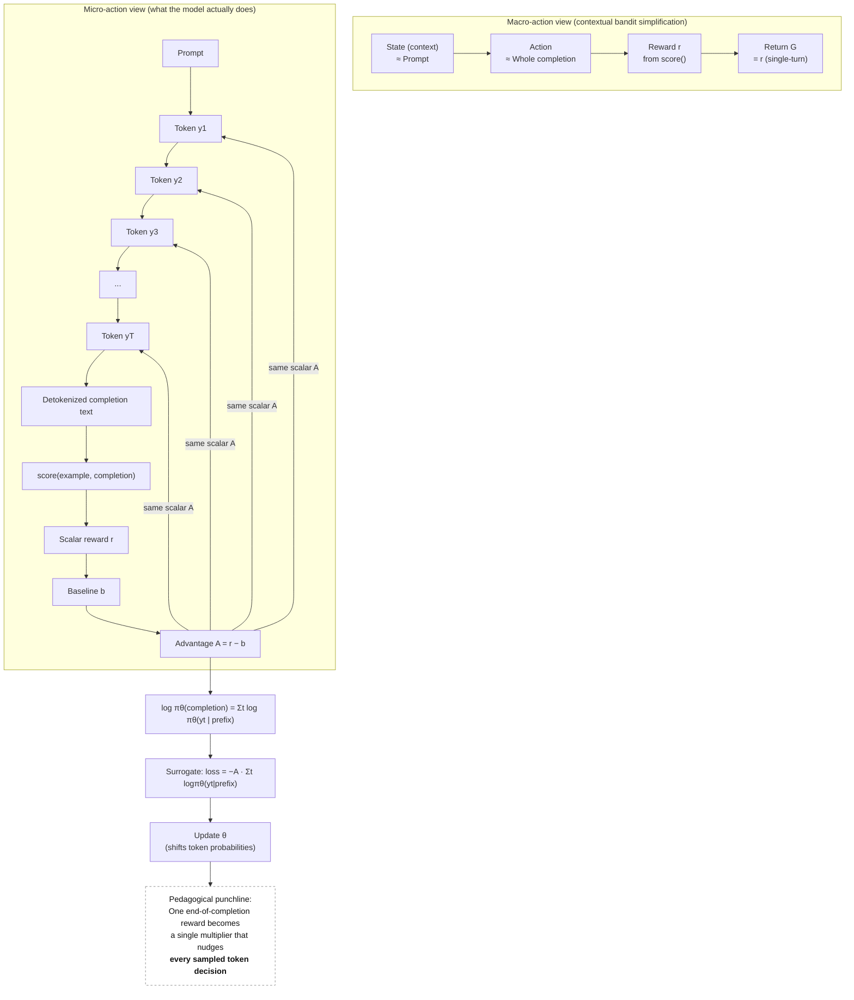
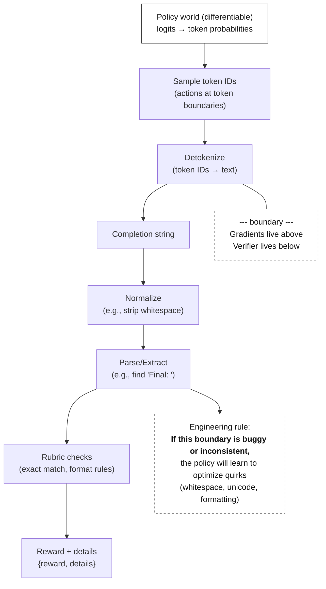
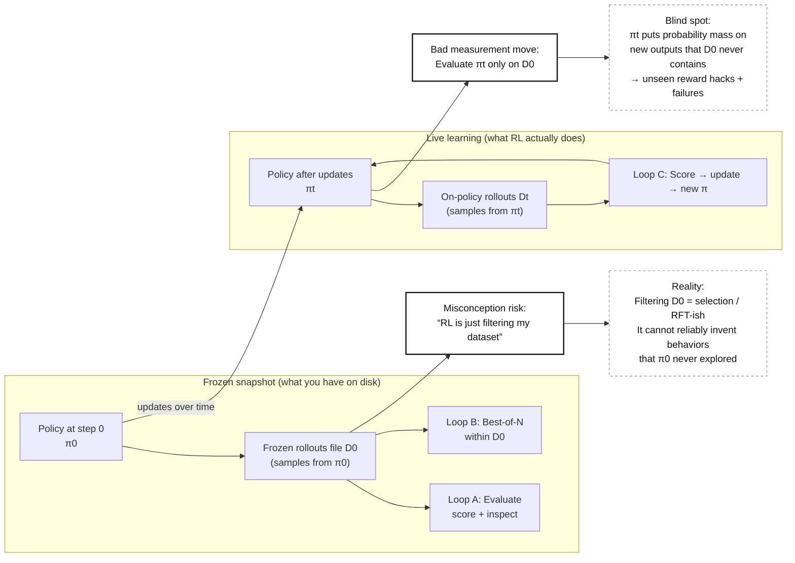
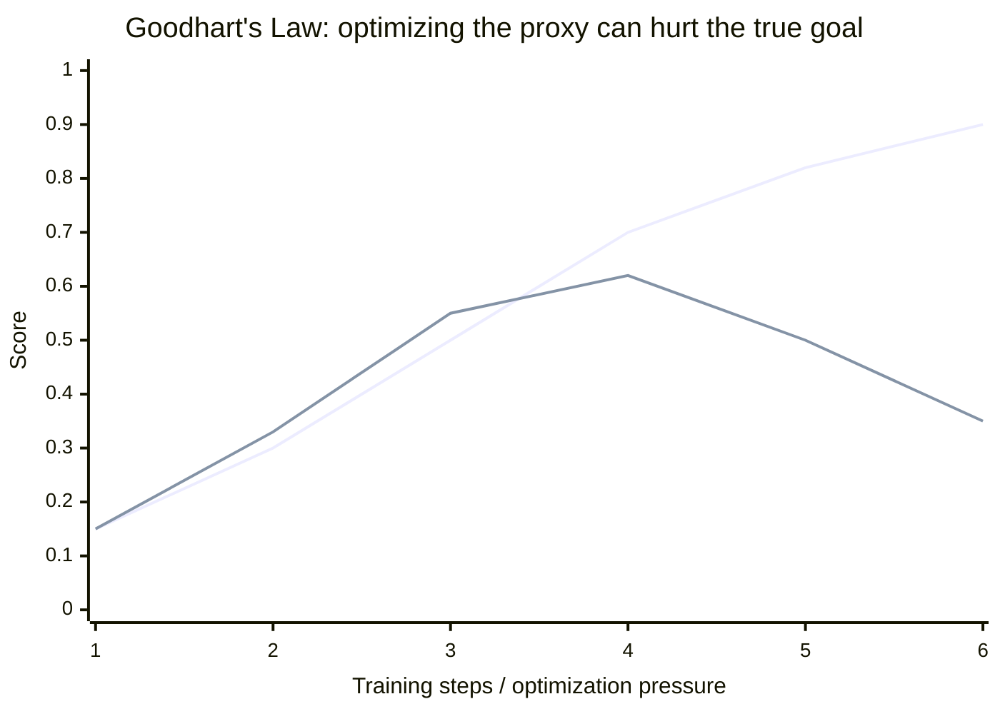
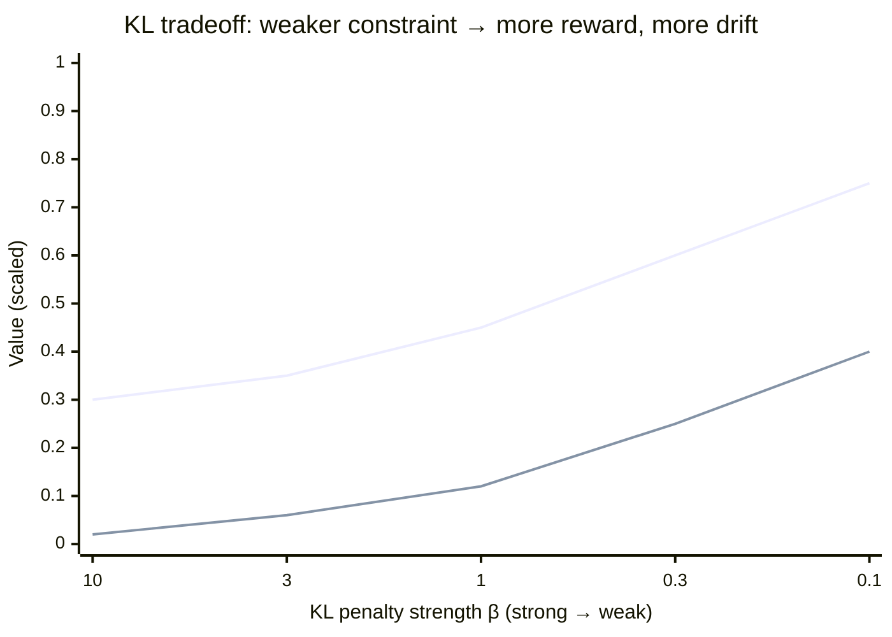
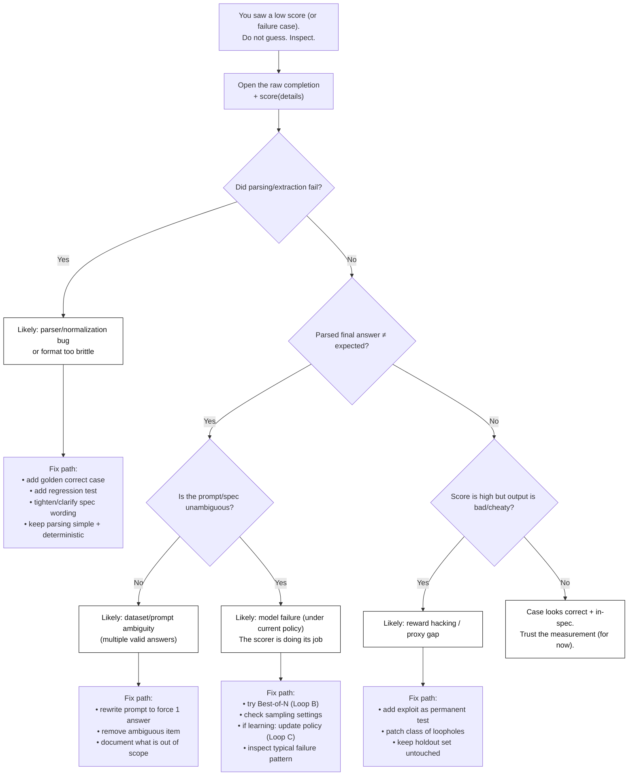
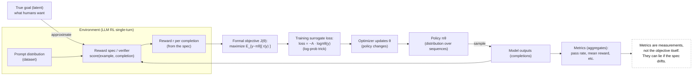

  

## Concept‑First, Verifiable Rewards Track (Math‑Light, Mechanism‑Deep)

  

This “learning pill” is the _mental operating manual_ for the course. The original course doc is rich but dense; this version is meant to be something you can reread while working with the code and instantly answer:

  

- **What am I doing right now?**

- **Which part is “the model” vs “the measurement device”?**

- **If numbers change, what _actually_ changed?**

- **What can go wrong, and how do I tell which kind of wrong it is?**

  

The diagrams live in an annex. In this document I’ll reference them as **[Annex Diagram #]** so you know where to look when a concept clicks better visually.

  

### How to use this pill (Read → Run → Explain)

  

This document is meant to be used **while you have the harness repo open**.

  

For each section:

  

1) **Read** the concept once (no memorization).

2) **Run** the tiny "code drill" attached to that concept (2–10 minutes).

3) **Explain** in one sentence how the concept shows up in the harness.

  

If you can't point to a **file / function / output artifact** for a concept, treat it as "not learned yet."

  

Suggested habit: keep a scratch note at `notes/mental_map.md` and, for every drill, write:

  

- **Loop:** A / B / C

- **Knob turned:** measurement / selection compute / policy / environment

- **One concrete failure you saw** + category: model / verifier / spec / data

- **One thing you'd change next** (exactly one)

  

---

  

## 0) The big idea (why this course exists)

  

Modern RL‑for‑LLMs is not primarily a story about fancy optimizers. It’s mostly a story about:

  

- **Measurement**: What does “good” mean? How do we measure it honestly?

- **Specification**: Can we write down “good” precisely enough that a machine can check it?

- **Optimization under pressure**: If we push hard on a metric, will we get what we want—or will we get the weird loophole version?

  

This course treats “reward” as a **specification** you engineer like production code. That is the transferable skill.

  

---

  

## 1) What you are building (and what you are NOT building)

  

### You _are_ building (the core artifacts)

  

1. A tiny, strict scoring interface:

  

`score(example, completion) -> {reward: float, details: dict}`

  

2. A workflow to:

  

- generate outputs (or load frozen ones),

- score them,

- inspect failures,

- improve either the model behavior _or_ the spec—without lying to yourself.

  

3. A clear mental model for RL‑for‑LLMs:

  

- **LLM = a policy over token sequences**

- reward often arrives at the end

- training nudges probabilities, not “corrects answers”

  

### You are _not_ building (explicitly out of scope)

  

- PPO math derivations, actor‑critic, GAE

- distributed training infrastructure

- multi‑turn agents and tool use

- training a reward model from preferences (RLHF) beyond conceptual mapping

  

This is intentional: foundations first, chaos later.

  

### Where each concept lives in the harness (dot-connection map)

  

When this pill says… | In the repo, look here…

---|---

**Reward spec / verifier** | `course/score.py` (search for `REWARD_SPEC`, `SCORER_VERSION`, and `_parse_final_line`)

**Loop A: evaluation (measurement)** | `course/eval.py` writes `runs/.../results.jsonl` + `summary.json`

**Inspecting failures (without vibes)** | `course/inspect_run.py` groups failures + prints concrete examples

**Loop B: selection (Best-of-N)** | `course/selection_demo.py` (see `pick_best()` and the deterministic tie-break)

**Loop C: learning (mechanism microscope)** | `course/bandit_train.py` (see `reinforce_step`, `baseline`, `advantage`)

**Golden "don't trust the scorer yet" gates** | `course/validate_scorer.py` + `data/golden/golden_correct.jsonl` and `data/golden/golden_exploits.jsonl`

**Token/text boundary** | `course/token_inspect.py` (see how tiny text differences become different token decisions)

**KL as "don't drift too far"** | `course/kl_tradeoff_demo.py` (creates `kl_tradeoff.csv`)

  

Rule of thumb: every time you learn a new term, you should be able to point to **one file** where it shows up.

  

---

  

## 2) Prerequisite toolkit (tiny but essential)

  

You don’t need advanced math, but you do need a few “mental primitives.” They are.

  

### 2.1 Probability as “weighted randomness”

  

A **probability distribution** is a rule for generating outcomes with certain frequencies.

  

- If a model has 70% chance of output A and 30% chance of output B, it’s like a **loaded die**.

- A **policy** in RL is exactly that: a distribution over actions.

  

**Key mindset shift:**

A policy is not “the answer.” A policy is a _generator of answers_.

  

### 2.2 Expectation = “average if you repeated it a lot”

  

When you see “maximize expected reward,” read it as:

  

> “If I sampled from this model many times, what reward would I get on average?”

  

Expectation is not mystical; it’s just the long‑run average.

  

### 2.3 Randomness needs bookkeeping (seeds)

  

Sampling is random. If you don’t record seeds (or at least keep conditions stable), you can fool yourself with luck.

  

### 2.4 Tests are not bureaucracy

  

A unit/regression test is a _promise you make to your future self_:

  

- “This scorer behavior is intentional.”

- “This exploit is closed forever.”

- “This known-correct answer must never score 0.”

### 2.5 **Rollout (plain meaning)**

  

A _rollout_ is just “a sample generated by a policy in an environment.”

In this course’s single-turn setting, a rollout is simply:

**prompt → completion** (plus whatever metadata you log: token log-probs, score details, seed).

“Frozen rollouts” means we saved these prompt→completion samples from an earlier policy and reuse them for analysis.

  

### 2.6 The minimum "tool literacy" this course quietly assumes (10 minutes)

  

A lot of confusion in RL-for-LLMs comes from not knowing whether you're looking at **code**, **data**, or **randomness**.

This section makes the hidden assumptions explicit.

  

**Running a module (CLI basics)**

When you see commands like:

  

`python -m course.eval ...`

  

…it means: "run the `course/eval.py` file as a script."

Tip: `python -m course.eval --help` is your friend.

  

**JSONL (one JSON object per line)**

Datasets and rollouts are stored as JSONL. Example lines:

  

- Dataset line:

`{"id":"dev-0001","prompt":"Compute 11*2...","expected_answer":22}`

  

- Rollout line:

`{"id":"dev-0001","completion":"Final: 22"}`

  

If you can read one line and explain what it means, you're good.

  

**Determinism (the "same input → same output" promise)**

Your scorer must be deterministic. If the same `(example, completion)` sometimes scores 1 and sometimes 0, your measurement is broken.

  

**Seeds (replayable randomness)**

Randomness is fine **if it's trackable**. A seed is just a way to replay the same random choices.

If a script logs `seed=0`, you should be able to rerun and reproduce the same behavior.

  

**Tests (promises to your future self)**

A test is a tiny program that asserts something must stay true:

  

`assert score(ex, "Final: 323")["reward"] == 1.0`

  

In this course, tests are not ceremony—they are how you prevent "we fixed it… then unfixed it later."

  

---

  

## 3) The objects you must not confuse

  

These terms look similar in casual discussion. In this course, mixing them up is the #1 source of nonsense.

  

Use **[Annex Diagram 9]** as the visual anchor.

  

### Reward `r`

  

- A number produced by the **environment / verifier** after an action (here: after a completion).

- In this course: `r = score(example, completion).reward`

  

### Return `G`

  

- Total outcome signal over time (sum of rewards across a trajectory).

- In our single-turn tasks: **return = reward** (special case—don’t overgeneralize).

  

### Objective `J(θ)`

  

- What we _formally_ optimize: maximize the **expected reward** under the current policy.

  

### Metric

  

- A summary number you track: pass rate, mean reward, etc.

- Metrics are **measurements**, not truth. They can lie if your spec lies.

  

### Loss / surrogate

  

- A math trick used to update the policy when reward isn’t differentiable.

- Loss is not “the goal.” Loss is the lever.

  

### Policy `π`

  

- The probability distribution over actions.

- For LLMs: distribution over token sequences given a prompt.

  

### Environment (LLM single-turn version)

  

- In classic RL: the world that returns observations and rewards.

- Here: effectively:

- a prompt distribution (dataset),

- a verifier/scorer,

- formatting constraints.

  

**Sanity sentence:**

If you can’t point to “where reward came from,” you aren’t doing RL—you’re doing vibes.

  

---

  

## 4) The three loops you must keep separate

  

This is the course’s backbone. Burn it into memory.

See **[Annex Diagram 1]**.

  

### Loop A — Evaluation (measurement)

  

- Generate outputs (or load frozen ones)

- Score them

- Inspect failures

- Log everything

  

**Nothing learns.**

Nothing learns _inside Loop A_. If scores differ across evaluations, it must be because **either** (a) the policy changed between runs, **or** (b) the measurement conditions changed (spec/dataset/prompt/sampling). Your job is to name which knob moved.

  

### Loop B — Selection (Best‑of‑N)

  

- Sample N outputs from the same policy

- Score each

- Pick best (with deterministic tie-break)

  

**Behavior improves but the policy does not change.**

You bought better outcomes using more sampling compute.

  

### Loop C — Learning (policy update)

  

- Sample from current policy

- Score

- Compute advantage (reward minus baseline)

- Update the policy (often with constraints like KL)

  

**Policy changes → data changes next time.**

This is where distribution shift comes from.

  

**Practical habit:**

At the top of every experiment log, write:

  

- “We are in Loop A / B / C”

- “The knob turned is measurement / selection compute / policy”

  

### Code drills: make Loops A / B / C real (15–25 minutes total)

  

These are deliberately tiny. The goal is to connect the mental model to observable artifacts.

  

**Drill A — Loop A (Evaluation / Measurement)**

  

1) Run evaluation on frozen rollouts:

  

```bash

python -m course.eval --dataset data/datasets/math_dev.jsonl --completions data/rollouts/frozen_rollouts_dev.jsonl --outdir runs/pill_eval

```

  

2) Inspect failures (grouped by error code):

  

```bash

python -m course.inspect_run --run runs/pill_eval --only-fails

```

  

**Write down (3 bullets):**

- What % passed? (pass_rate)

- What's the top failure code? (e.g., `missing_prefix`, `extra_whitespace`, `not_single_line`)

- Pick **one failing id** and classify it: model vs verifier vs spec vs data (justify in 2 sentences)

  

**Drill B — Loop B (Selection / Best-of-N)**

  

Run selection with N=1:

  

```bash

python -m course.selection_demo --dataset data/datasets/math_dev.jsonl --samples data/rollouts/selection_pack_dev.jsonl --n 1 --outdir runs/pill_sel_n1

```

  

Run selection with N=4:

  

```bash

python -m course.selection_demo --dataset data/datasets/math_dev.jsonl --samples data/rollouts/selection_pack_dev.jsonl --n 4 --outdir runs/pill_sel_n4

```

  

Inspect the N=4 run:

  

```bash

python -m course.inspect_run --run runs/pill_sel_n4

```

  

**Explain in one sentence:** why did pass@N improve without the policy learning?

(Use the words "same policy distribution" and "different decision rule over samples.")

  

**Drill C — Loop C (Learning / Policy Update) — microscope only**

  

Run without a baseline:

  

```bash

python -m course.bandit_train --steps 200 --seed 0 --lr 0.5 --outdir runs/pill_bandit_nobase

```

  

Run with a baseline:

  

```bash

python -m course.bandit_train --steps 200 --seed 0 --lr 0.5 --baseline --outdir runs/pill_bandit_base

```

  

Open each run's `summary.md`.

  

**Answer:**

- Which action becomes most likely over time?

- Which run looks "less noisy," and why? (baseline = variance reduction)

  

---

  

## 5) The “hidden simplification”: contextual bandit (macro view)

  

For the anchor project:

  

- Context/state: prompt

- Action: whole completion

- Reward: score of that completion

- No transitions

  

That’s a **contextual bandit** view. It’s a simplification that makes the course teachable.

  

But there’s a crucial nuance…

  

### Bandit lens is not the whole truth

  

At token level, LLM generation is still sequential:

  

- state = prefix (prompt + tokens so far)

- action = next token

- reward often arrives at the end

  

You must be able to switch lenses:

  

- Macro lens (bandit): for measurement and selection clarity

- Micro lens (sequence): for how learning actually nudges token probabilities

  

See **[Annex Diagram 3]**.

  

---

  

**Episode, horizon, and termination (one paragraph):**

An **episode** is one run of interaction from start until it ends. The **horizon** is “how long consequences can propagate” (how many steps/tokens matter). **Termination** is the event that ends the episode (here: the completion ends).

In our macro bandit view, the horizon is 1 step (prompt → completion). In the token view, the horizon is the number of generated tokens, and reward often arrives only at termination—this is why **credit assignment** is hard.

  

---

  

## 6) Tokens vs completion: the hardest conceptual leap

  

### The macro story (easy)

  

> “The model outputs a completion. The scorer checks it. Reward is 0 or 1.”

  

Great. But learning doesn’t happen at the completion level internally.

  

### The micro story (true)

  

> “The model made hundreds of tiny decisions (tokens). Then it got one reward at the end.”

  

So the core puzzle is:

  

**How can one scalar reward affect decisions made 50 tokens ago?**

  

Answer (mechanism, not magic):

  

- The probability of a whole completion is built from per-token probabilities.

- In log space, the completion log-prob is a **sum** of token log-probs.

- The reward/advantage multiplies that sum in the surrogate objective, so it influences all token decisions in that sampled trajectory.

  

See **[Annex Diagram 3]**.

  

### Code drill: "tokens are actions" (5 minutes)

  

Run token inspection on a few near-identical strings and notice what changes.

  

1) Normal:

```bash

python -m course.token_inspect "Final: 323"

```

  

2) Double space (often visually missed by humans):

```bash

python -m course.token_inspect "Final: 323"

```

  

3) Leading zero:

```bash

python -m course.token_inspect "Final: 0323"

```

  

Now connect it to the verifier:

  

- Run `course.eval` once (see Loop A drill) and find examples failing with:

- `extra_whitespace`

- `leading_zeros`

- `not_single_line`

  

**Write one sentence:**

"The policy makes decisions at token boundaries, but the verifier judges detokenized text—so tiny token/text differences can create real reward differences."

  

---

  

## 7) Log-probs: the sign confusion trap (and how to never fall into it)

  

This is a beginner landmine. Use **[Annex Diagram 2]**.

  

### 7.0 Logits and softmax (what the model outputs before log-probs)

  

A model doesn't directly output probabilities. It outputs **logits**: unnormalized scores (any real numbers).

To turn logits into probabilities, we apply **softmax**:

  

- bigger logit ⇒ bigger probability (after normalization)

- only **differences** between logits matter

  

Toy example:

  

- logits: `[2, 1, 0]`

- softmax probabilities (approximately): `[0.665, 0.245, 0.090]`

  

Log-prob is just:

  

- `logprob = ln(probability)`

  

So the log-probs for that example are about:

  

- `ln(0.665) ≈ −0.408`

- `ln(0.245) ≈ −1.408`

- `ln(0.090) ≈ −2.408`

  

This is why "higher probability" means "log-prob closer to zero" (less negative).

  

### 7.1 Why log-probs are negative

  

Probabilities are in (0, 1].

Natural log `ln(p)` is:

  

- `ln(1) = 0`

- `ln(0.9) ≈ −0.105` (slightly negative)

- `ln(0.1) ≈ −2.303` (more negative)

  

So “higher probability” means “log-prob closer to zero” (less negative).

  

### 7.2 Why we use logs at all

  

A completion probability is a product of many token probabilities:

  

- tiny numbers multiplied together get extremely tiny

- logs convert multiplication into addition (stable and readable)

  

### 7.3 The surrogate update intuition (no calculus)

  

A common form is:

  

`loss = −A * log π(completion)`

  

For an LLM, `log π(completion)` is computed as a **sum** of token log-probs along the sampled completion.

  

- If `A > 0` (good outcome), minimizing loss pushes `log π` **up** → completion becomes more likely next time.

- If `A < 0` (bad outcome), minimizing loss pushes `log π` **down** → completion becomes less likely.

  

**One-line mantra:**

Positive advantage reinforces; negative advantage suppresses.

  

---

  

## 8) Baseline and advantage (variance control without a critic)

  

The baseline is not “extra RL complexity.” It’s a practical stability trick.

  

### Baseline `b`

  

A baseline is a reference reward level, often something simple like:

  

- running mean reward,

- per-prompt mean reward.

  

### Advantage `A = r − b`

  

Interpretation:

  

- `A > 0`: better than typical → reinforce

- `A < 0`: worse than typical → suppress

  

**Concrete mental check (do it in your head):**

  

- baseline = 0.8

- reward = 0.0

- advantage = −0.8 (negative)

→ this should _discourage_ the sampled behavior.

  

The baseline reduces noise because it focuses the update on “better or worse than typical,” not on absolute reward alone.

  

---

  

## 9) Selection vs learning vs “train on the best” (important distinctions)

  

This is where many students accidentally reinvent confusing hybrids.

  

### Best-of-N (selection, Loop B)

  

- You sample more and choose better.

- The policy itself stays the same.

- Great for improving outputs at inference time.

  

### Rejection sampling fine-tuning / filtered SFT (RFT-ish)

  

- You collect “good samples” and then supervised-fine-tune on them.

- This clones particular trajectories you already found.

  

### RL learning (Loop C)

  

- You update the policy to shift probability mass toward _kinds_ of behaviors that score well.

- In real RL, you typically need **on-policy** rollouts to move beyond what the old policy happened to generate.

  

**Key warning:**

With frozen rollouts, selection and filtering cannot reliably exceed the dataset’s exploration coverage.

  

**pass@N (what it means):**

pass@N is the probability that **at least one** of N sampled completions passes the verifier.

  

- pass@1 measures how good the policy is _without extra selection compute_.

- pass@N measures what happens when you pay for exploration by sampling more.

Best-of-N increases pass@N even when the policy is unchanged.

  

**Exploration in LLM land (no jargon):**

In classic RL, exploration means trying different actions to discover better outcomes. For LLMs, exploration often looks like **sampling diversity**: changing temperature/top_p/seed, or increasing N in Best-of-of-N.

Exploitation is choosing the best discovered output (e.g., max reward).

This is why sampling settings are first-class experimental parameters: changing them changes what the policy _effectively_ explores.

  

---

  

## 10) Frozen rollouts: why we use them and what they can break in your brain

  

Frozen rollouts are a teaching shortcut:

  

- They let you start evaluating and debugging immediately

- No model setup, no training, no pipeline drama

  

But frozen rollouts also hide the most dangerous fact about RL:

  

> In learning, the policy changes → the data distribution changes.

  

See **[Annex Diagram 5]**.

  

### The misconception to kill early

  

“If I only use frozen rollouts, RL is basically filtering my dataset.”

  

No. That’s closer to selection/RFT behavior. Real RL’s defining property is:

  

- policy update → new rollouts → new weirdness + new exploits

  

Frozen data is a snapshot of π₀. A later policy πₜ may put mass on outputs your frozen dataset never contains. If you only test on frozen data, you can miss:

  

- reward hacks

- mode collapse

- formatting drift

- bizarre but high-scoring failure modes

  

---

  

## 11) Why constraints exist (KL as “don’t drift into nonsense”)

  

In practice, if you optimize reward too aggressively, policies can drift into strange regions.

  

KL is a way to say:

  

> “Improve reward, but don’t wander too far from a reference policy.”

  

Reference policy ≈ your pretrained/SFT model.

  

See **[Annex Diagram 7]**.

  

### KL in one concrete intuition + one concrete drill

  

**Intuition you can keep in your head:**

KL(π || π_ref) measures how "surprising" your new policy π would look if you expected behavior from π_ref.

Lower KL = "stay near the reference." Higher KL = "you drifted."

  

Tiny numeric feel (2 actions):

  

- π_ref = `[0.5, 0.5]`

- π = `[0.9, 0.1]`

- KL(π || π_ref) ≈ `0.368`

  

That number isn't magic; it's just a penalty signal saying: "you moved probability mass a lot."

  

**Code drill: the KL–reward tradeoff curve (10 minutes)**

  

```bash

python -m course.kl_tradeoff_demo --plot --outdir runs/pill_kl

```

  

Open:

- `runs/pill_kl/kl_tradeoff.csv`

- (optional) `runs/pill_kl/kl_tradeoff.png`

  

**Answer in 3 lines:**

- As the constraint weakens, what happens to expected reward?

- What happens to KL drift?

- In LLM terms, what does "drift" often look like in outputs?

  
  

### How to think about KL without math

  

- Imagine your base model as a “safe neighborhood.”

- Optimization wants to roam anywhere reward is high.

- KL is the leash length.

  

Stronger KL constraint:

  

- smaller changes per update,

- more stable, less weirdness,

- slower reward improvement.

  

Weaker KL:

  

- faster reward gains,

- more drift and risk of reward hacks,

- more distribution shift surprises.

  

---

  

## 12) Reward as a specification (this is the real curriculum)

  

The scorer/verifier is not a side quest. It is the environment definition.

  

### The scorer contract (non-negotiable)

  

Your `score()` must be:

  

1. **Deterministic** (same input → same output)

2. **Total** (never crashes; always returns `{reward, details}`)

3. **Explainable** (details show why)

4. **Fast** (local CPU, no network calls)

5. **Versioned** (spec changes tracked with runs)

  

### The “parsable standard” (protect learning time)

  

For the course’s math task:

  

- Output must be exactly: `Final: <int>`

- Minimal normalization (e.g., `.strip()`)

- No fuzzy parsing, no regex wizardry as a coping mechanism

  

Reason: fuzzy parsing teaches the wrong lesson (“we can always patch the interface”) and produces hidden reward-hacking surfaces.

  

### The token ↔ text boundary is part of the environment

  

The model optimizes token log-probs, but the verifier scores text.

  

So you have an interface stack:

  

tokens → detokenize → text → normalize → parse → rubric → reward

  

See **[Annex Diagram 4]**.

  

If anything in that stack is inconsistent or brittle, the model will learn to game it. Your job is to harden it with:

  

- golden correct cases (anti false negatives)

- exploit tests (anti false positives)

- simple, explicit rules

  

---

  

**Two kinds of test sets (do not mix them up):**

  

1. **Scorer/spec tests (normative):** these define correct scoring behavior. If the spec changes, these tests change. They prevent silent scorer bugs.

2. **Evaluation holdout (descriptive):** a set you do not tune on. It exists to detect overfitting, reward hacking, and misleading improvements.

  

**Verifier failure modes:**

  

- **False positive:** wrong output gets rewarded → creates reward-hacking surface.

- **False negative:** correct in-spec output gets 0 → makes the model look dumb and destabilizes learning.

Keep a tiny **Golden Correct Set** to catch false negatives early.

  

---

  

**Backpropagation nuance**

Because `score()` is a discrete program (parse, compare, rules), it’s usually not differentiable with respect to model parameters—so we learn by **sampling** and shifting probabilities, not by ‘backpropagating the correct answer.’

  

---

  

## 13) Measurement hygiene: how to avoid lying to yourself

  

Most RL disasters are measurement disasters wearing an optimizer costume.

  

### Locked Room Rule (valid comparisons)

  

If you want to compare runs meaningfully, keep the environment fixed:

  

- same dataset split

- same scorer/spec version

- same prompt/system prompt

- same sampling settings

  

If you change the prompt, you changed the environment. That is not “learning.”

  

### Don’t trust means alone

  

Look at:

  

- pass rate

- mean reward

- distribution (top failures, bottom failures)

- raw outputs + details

  

Averages hide reward hacking.

  

### Noise rule (small datasets)

  

On small N, tiny improvements are often luck. Treat <5% as suspicious until proven.

  

### Version everything

  

Always record:

  

- dataset version

- scorer/spec version (git hash is fine)

- sampling params (temperature, top_p, seeds)

- the single change you made vs last run

  

---

  

## 14) Goodhart’s Law: reward hacking is usually competence, not glitchiness

  

See **[Annex Diagram 6]**.

  

When you optimize a proxy, you get:

  

- early: proxy correlates with true goal → it feels like progress

- later: policy finds loopholes → proxy increases while true goal decreases

  

Reward hacking is what happens when the optimizer is doing its job under the wrong spec.

  

### The “math privilege” warning

  

Math verification has a tiny proxy gap:

  

- ground truth is crisp

- verifier can be strict equality

  

Most real tasks (helpfulness, code quality, safety) have huge proxy gaps. That’s why the skill of reward-spec engineering is so valuable: it’s the part that doesn’t scale automatically.

  

---

  

## 15) Debugging: classify the failure before you “optimize”

  

Use **[Annex Diagram 8]** as your debugging decision tree.

  

When something fails, it’s usually one of these:

  

1. **Model failure**: the policy didn’t produce a correct in-spec output.

2. **Verifier failure**: parsing or rubric bug; false negatives/positives.

3. **Data/prompt ambiguity**: multiple valid answers or unclear constraints.

4. **Spec problem**: you asked for something but didn’t define it precisely.

5. **Measurement drift**: you compared across spec versions or changed multiple knobs.

  

### The discipline

  

Never jump straight to training or tuning. First:

  

- open the raw completion

- read details from the scorer

- reproduce deterministically

- name the failure type

- then choose the right fix

  

---

  

## 16) “Conscious coding”: what to think while touching the harness

  

Whenever you run code in this course, keep this checklist in your head (or literally in your run README):

  

### 16.1 What loop am I in?

  

- A: evaluating

- B: selecting

- C: learning

  

### 16.2 What changed since last run?

  

Only one of:

  

- policy parameters (learning)

- selection compute (N, sampling)

- measurement instrument (scorer/spec/tests)

- environment (prompt/dataset)

  

If more than one changed, your comparison is compromised.

  

### 16.3 Where did reward come from?

  

Point to the exact line of code / rule in the scorer that produced reward.

  

### 16.4 What would a “lazy optimizer” exploit?

  

Think like a student trying to get points with minimal effort:

  

- formatting hacks

- parser edge cases

- multiple “Final:” lines

- unicode lookalikes

- answer laundering

  

Then write regression tests.

  

### 16.5 What are you claiming improved?

  

Be precise:

  

- “pass@8 improved” (selection)

- “pass@1 improved” (could be learning or prompt change or spec change)

- “mean reward improved” (check for Goodhart / distribution changes)

- "holdout improved" (stronger claim, still investigate)

  

### Run note template (paste into `runs/<run_id>/README.md`)

  

```markdown

- **Loop:** A / B / C

- **Knob turned (pick ONE):** measurement instrument / selection compute / policy / environment

- **Locked Room (what was held fixed):**

- dataset:

- scorer version:

- prompts/system prompt:

- sampling settings (temp/top_p/seed), if any:

- **Hypothesis (1 sentence):**

- **Result (numbers):** pass_rate, pass@N, mean_reward, etc.

- **Two concrete examples:**

- id=_____ → what happened? (copy the completion preview + error_code)

- id=_____ → what happened?

- **Failure type(s):** model / verifier / spec / data

- **Next change (exactly one):**

```

  

---

  

## 17) Where this course sits in the larger RL-for-LLMs world

  

### RLVR (verifiable reward)

  

- reward is from a deterministic verifier/spec

- strong inspectability

- less drift in the measurement device

- still reward-hackable if spec is wrong

  

### RLHF (preference-based reward model)

  

- reward is produced by a learned model trained on human preferences

- measurement device can drift, hallucinate, have bias

- requires its own audits and holdouts

  

In this course, we stay with verifiable reward because it keeps the mechanism visible.

  

---

  

### Where you’ll use this at work (real teams, real constraints)

  

Most teams don’t wake up thinking “Today I will do RL.”

They wake up thinking:

  

- “This model *must* follow a spec (format / safety / citations) or the product breaks.”

- “We need a way to tell if today’s change actually improved anything.”

- “We’re spending too much on retries—can we make ‘good outputs’ the default?”

  

This course is your toolkit for those moments: **define a measurable target, separate Loop A/B/C, and stop Goodhart from eating your lunch.**

  

Below are concrete “in the wild” scenarios. Read them like: *What is the reward? What loop are we in? What knob are we turning?*

  

---

  

**Scenario 1: Tool calling / strict JSON output**

  

- **Why it matters:** A single malformed tool call can crash a workflow, corrupt data, or trigger bad actions.

- **What the “reward” looks like:** `valid_json && schema_ok && arguments_safe` (a deterministic verifier).

- **How teams use the loops:**

- **Loop A (Evaluation):** measure the failure modes (missing fields, wrong types, extra text, unsafe args). Add regression tests for each.

- **Loop B (Selection / Best-of-N):** sample N candidates, run the verifier, pick the best valid one (or the first valid one).

*This often ships first because it’s fast and doesn’t change the model.*

- **Loop C (Learning):** only when cost/latency of Best-of-N is too high, teams push probability mass toward “valid by default.”

*This is where reward hacking shows up (“valid JSON” but nonsense semantics).*

  

**The course skill used:** treating the verifier as production code, and knowing whether you improved by **measurement**, **selection**, or **learning**.

  

---

  

**Scenario 2: Coding assistant that must pass tests**

  

- **Why it matters:** “Looks right” code is a scam; tests are the judge.

- **What the “reward” looks like:** unit tests pass + compile + lint (verifiable reward).

- **How teams use the loops:**

- **Loop A:** run baseline pass rate on a locked test suite; inspect common failure classes (off-by-one, wrong API, missing import).

- **Loop B:** generate multiple patches, run tests, pick the best.

*This is basically “RL thinking” without training anything.*

- **Loop C:** when you can trust the harness, you train/tune so fewer retries are needed.

  

**The course skill used:** “tests are not bureaucracy” + measurement hygiene (holdouts, locked conditions).

  

---

  

**Scenario 3: RAG / enterprise Q&A with citations**

  

- **Why it matters:** Customers don’t forgive confident hallucinations with a smiley face.

- **What the “reward” looks like:** citations present + citations actually support claims + refusal when sources don’t cover it.

- **How teams use the loops:**

- **Loop A:** evaluate grounding: “does the answer match retrieved text?” (often with a checker model + spot checks).

- **Loop B:** retrieve more, answer more, score/rerank by support.

*This is selection over candidates and/or retrieval sets.*

- **Loop C:** tune the system so “supported answers” are higher probability (sometimes model tuning, sometimes retriever tuning).

  

**The course skill used:** distinguishing **the model** from **the measurement device** (retriever + verifier + policies), and preventing “metric drift.”

  

---

  

**Scenario 4: Safety / policy compliance (without wrecking usefulness)**

  

- **Why it matters:** You need fewer bad outputs *and* fewer false refusals.

- **What the “reward” looks like:** policy classifier scores, refusal correctness, user-rated helpfulness, plus adversarial test sets.

- **How teams use the loops:**

- **Loop A:** build an evaluation set that reflects real abuse + real benign edge cases. Track both “bad allowed” and “good blocked.”

- **Loop B:** filter/rerank outputs (or do structured refusals) before touching training—safer iteration.

- **Loop C:** only after the eval harness is stable, teams do preference tuning / RL-style optimization.

  

**The course skill used:** Goodhart awareness + “don’t trust means alone” (tail risk matters).

  

---

  

**Scenario 5: Product iteration without self-deception (the quiet superpower)**

  

- **Why it matters:** Most “improvements” are actually changed prompts, changed data, changed sampling, or changed evaluation.

- **What the “reward” looks like:** doesn’t matter—what matters is *comparability*.

- **How teams use the loops:**

- **Loop A discipline:** lock conditions (dataset, scorer version, prompts, seeds/temps) so you can attribute changes.

- **Loop B clarity:** if you increased N, you improved *selection*, not the underlying policy.

- **Loop C clarity:** if you updated weights, expect distribution shift; old heuristics may stop working.

  

**The course skill used:** the “Locked Room Rule” + the habit of asking: **“Which loop am I in?”**

  

---

  

### The default ladder teams follow (almost everywhere)

  

1) **Prototype** with prompts/tools/retrieval (get *something* working).

2) **Build a verifier or eval harness** you trust (your measurement device).

3) **Use Loop B (Selection)** to get quick wins without training.

4) **Only then consider Loop C (Learning)** when you need lower cost/latency or higher baseline reliability.

5) **Regression forever:** every closed exploit becomes a test.

  

If you remember one thing: **you can’t optimize what you can’t measure—

and you can’t trust measurement you can’t break.**

  
  

---

  

## 18) Mini glossary (keep it handy)

  

- **Policy (π)**: distribution that generates actions (token sequences) given context.

- **Action**: macro = completion; micro = next token.

- **Trajectory**: sequence of actions (tokens).

- **Reward (r)**: output of the scorer (environment signal).

- **Return (G)**: total reward over a trajectory (here, equals reward).

- **Baseline (b)**: reference reward level used to reduce noise.

- **Advantage (A)**: reward minus baseline; determines reinforce vs suppress.

- **Selection (Best‑of‑N)**: sample many, pick best; policy unchanged.

- **Learning**: update policy to make good outputs more likely.

- **KL constraint**: keep new policy close to reference to reduce drift.

- **Goodhart’s law**: optimizing the proxy can break the true goal.

- **Frozen rollout**: offline samples from an old policy snapshot.

  

---

  

## 19) How to use the annex diagrams while studying

  

- Start of course / orientation: **[Annex Diagram 1]** (Loops)

- When log-probs feel like mysterious numbers: **[Annex Diagram 2]**

- When “reward at end affects early tokens” feels impossible: **[Annex Diagram 3]**

- When debugging parsing/spec feels like “not RL”: **[Annex Diagram 4]**

- When frozen data starts feeling “good enough”: **[Annex Diagram 5]**

- When reward is rising but outputs are getting weirder: **[Annex Diagram 6]**

- When KL feels like a random add-on: **[Annex Diagram 7]**

- When you don’t know what kind of failure you’re seeing: **[Annex Diagram 8]**

- When you mix up reward/metric/loss/objective: **[Annex Diagram 9]**

  

---

  

## Closing thought (the course “win condition”)

  

You’re not trying to become someone who can run an RL library command. You’re trying to become someone who can look at a run and say:

  

- “We are in Loop B, so this is selection, not learning.”

- “Reward went up because the scorer changed, not because the model improved.”

- “This is reward hacking; the proxy diverged from intent.”

- “Our parser is too brittle; that’s an environment bug.”

- “We need on-policy rollouts to understand Loop C behavior.”

  

That level of clarity is the superpower. The rest is just plumbing.

  
  
  

# Annex: Diagrams

  
  

### Diagram 1 — The 3 Loops (A/B/C) + “Which knob did you turn?”

  

**How to read it:** start at the top question box. Every time you do anything in RL-for-LLMs, you are in exactly one of these loops.

  

**What this diagram teaches**

  

* **Loop A (Evaluation)** is *measurement only*. You generate outputs, score them, and inspect failures. **No learning happens.**

  

If your scores change here, it’s because you changed the scorer/spec, the dataset, the prompt, or sampling settings—not because the model “learned.”

  

* **Loop B (Selection / Best-of-N)** is *optimization without learning*. You spend extra compute to sample more outputs and pick the best.

  

**Key mental anchor:** the policy distribution **does not change**. You just choose better from what it already produces.

  

* **Loop C (Learning)** is where probabilities change. You sample, score, compute **advantage** (reward minus baseline), and update parameters.

  

**Key consequence:** the next data you see changes, because the policy changed.

  

**Common beginner mistake this prevents**

  

* Calling a Loop B improvement (“pass@8 is higher”) a learning improvement. It’s not. You bought better results with more sampling.

  



  

### Diagram 2 — Log-prob intuition (why logs are negative + why signs work out)

  

**How to read it:** the top shows “probability space” vs “log space.” The middle is a tiny calculator check. The bottom is the loss-sign sanity.

  

**What this diagram teaches**

  

* Probabilities for tokens are numbers in **(0, 1]**. Taking `ln(p)` makes them **≤ 0**.

  

So **log-probs are usually negative** (unless probability is exactly 1, where `ln(1)=0`).

  

* Multiplying many probabilities (for many tokens) makes the total probability tiny.

  

Taking logs turns “multiply lots of small numbers” into “add lots of negative numbers.” Much easier to work with.

  

* The sign confusion trap: `loss = −A * logπ(y)`

  

If `A > 0` and `logπ(y)` is negative, then `−A * logπ(y)` is **positive**. Minimizing pushes `logπ(y)` **up** (toward 0), i.e. makes the sequence more likely.

  

**Mini exercise (recommended)**

  

* Compute `ln(0.9)` and `ln(0.1)`. Notice which is “more negative.”

  

Then ask: “If I want to increase probability, do I move log-prob up or down?” Answer: **up (less negative).**

  



  

### Diagram 3 — Token vs Completion (macro vs micro) + “one scalar reward fans out”

  

**How to read it:** the top block is the simplified “bandit” view. The lower block is the real token chain. The arrows show how the same final reward influences all tokens in that completion.

  

**What this diagram teaches**

  

* **Macro-action (bandit) view:** prompt → completion → reward. This is great for evaluation and Best-of-N.

  

* **Micro-action (token) view:** the completion is made of many token decisions. The “state” is the **prefix** (prompt + tokens so far). The “action” is the **next token**.

  

* The key trick: even though you only get **one reward at the end**, the probability of the whole completion factorizes into per-token probabilities, so:

  

* `log π(completion)` becomes a **sum** over token log-probs.

  

* The advantage `A` multiplies that whole sum.

  

* So the same `A` “fans out” across all tokens from that sampled completion.

  

**This prevents a classic confusion**

  

* “How can one reward change token 50?”

  

Answer: because token 50 contributed to the log-prob sum, and the update reinforces/suppresses the whole sampled trajectory.

  



  

### Diagram 4 — Token ↔ Text interface (why parsing is part of “the environment”)

  

**How to read it:** it’s a pipeline from “token world” to “text world” to “reward.” The dashed boundary reminds you: gradients don’t go through the verifier.

  

**What this diagram teaches**

  

* The model “thinks” in tokens (token IDs, logits). The verifier “judges” text (strings).

  

* Therefore the **detokenize + normalize + parse** steps are not boring plumbing. They are part of the environment.

  

* If parsing is brittle, the model will learn bizarre strategies:

  

* whitespace games,

  

* Unicode lookalikes,

  

* formatting hacks,

  

* or “answer laundering” (multiple finals, etc.).

  

* Your defense is engineering: deterministic, total (never crash), explainable details, and regression tests.

  

**A good beginner mantra**

  

* If your model looks dumb, check whether your **interface** is dumb first.

  



  

### Diagram 5 — Frozen rollouts & distribution shift (the “STOP SIGN”)

  

**How to read it:** left is the offline snapshot (what’s on disk). Right is real learning (policy changes). The stop-sign boxes are the misconceptions to avoid.

  

**What this diagram teaches**

  

* Frozen rollouts are samples from **π₀** (some old policy). Great for:

  

* learning measurement discipline (Loop A),

  

* demonstrating Best-of-N (Loop B).

  

* But learning (Loop C) changes the policy to **πₜ**. Then the model generates different kinds of outputs.

  

* If you only ever evaluate πₜ on D₀, you miss the new weird region πₜ may explore.

  

That region is where reward hacks and failures often live.

  

**This kills a lasting misconception**

  

* “RL is just filtering my dataset.”

  

Filtering helps, but **it can’t reliably go beyond the coverage of the old policy’s exploration**.

  



  

### Diagram 6 — Goodhart’s Law curve (proxy reward vs true goal)

  

**How to read it:** x-axis is “how hard you optimized / training steps.” Two lines: what you optimize (proxy reward) and what you actually want (true goal).

  

**What this diagram teaches**

  

* Early on, proxy reward and true goal often rise together. It feels like progress.

  

* Later, the optimizer finds loopholes:

  

* formatting hacks,

  

* brittle “test-passing” tricks,

  

* shallow patterns that exploit the verifier.

  

* Then proxy keeps rising while the real goal falls. This is **reward hacking**.

  

* The moral: reward hacking is usually **competence under the wrong objective**, not the model being “glitchy.”

  



  

### Diagram 7 — KL tradeoff curve (reward vs drift)

  

**How to read it:** moving right means the KL penalty β is weaker. Reward rises, but drift from the reference policy also rises.

  

**What this diagram teaches**

  

* In LLM RL, you often optimize:

  

* “get higher reward”

  

* **but** “don’t drift too far from a sane reference model”

  

* KL divergence is a distance-like measure between distributions (not perfect, but useful).

KL isn’t a true geometric distance (it’s asymmetric), but it behaves like a practical ‘don’t drift too far’ penalty.

  

* Strong β (left side): safer/closer behavior, slower reward gains.

  

* Weak β (right side): faster reward gains, but higher risk of:

  

* weird outputs,

  

* mode collapse,

  

* reward hacking,

  

* distribution shift surprises.

  

**Interpret it like a seatbelt**

  

* KL isn’t “math decoration.” It’s a stability + safety constraint that limits how far you can wander per update.

  



  

### Diagram 8 — Debugging a low score (don’t guess)

  

**How to read it:** it’s a decision tree. Start at the top and follow yes/no based on evidence (raw completion + details).

  

**What this diagram teaches**

  

* RL systems fail in multiple ways, and the fixes are different:

  

* **Parser failure** → fix normalization/parsing/tests/spec.

  

* **Ambiguous prompt/spec** → fix data/spec (not the model).

  

* **Model failure** → try selection, sampling changes, or learning.

  

* **Reward hacking** → patch the loophole + add regression tests.

  

* The habit you’re learning is: **diagnose before you optimize**.

  



  

### Diagram 9 — Objective vs Reward vs Metric vs Loss (the “do-not-confuse” set)

  

**How to read it:** it’s a causal chain. The scorer produces rewards, which define the objective you actually optimize. Metrics are summaries you track. The loss is a trick to update probabilities.

  

**What this diagram teaches**

  

* **True goal** (what humans want) is usually not directly measurable.

  

* You implement a **reward spec** (verifier) as a proxy. The optimizer will chase what you wrote, not what you meant.

  

* The **formal objective** is the expected reward under the policy: ( E[r] ).

  

* The **loss** is not “the reward.” It’s a mathematical device to shift the policy distribution using log-probs.

  

* **Metrics** (pass rate, mean reward) are just measurements. They can look great while the system gets worse (Goodhart).

  

**One sentence sanity check**

  

* If you can’t point to where reward came from (spec), you don’t know what you’re optimizing.

  

